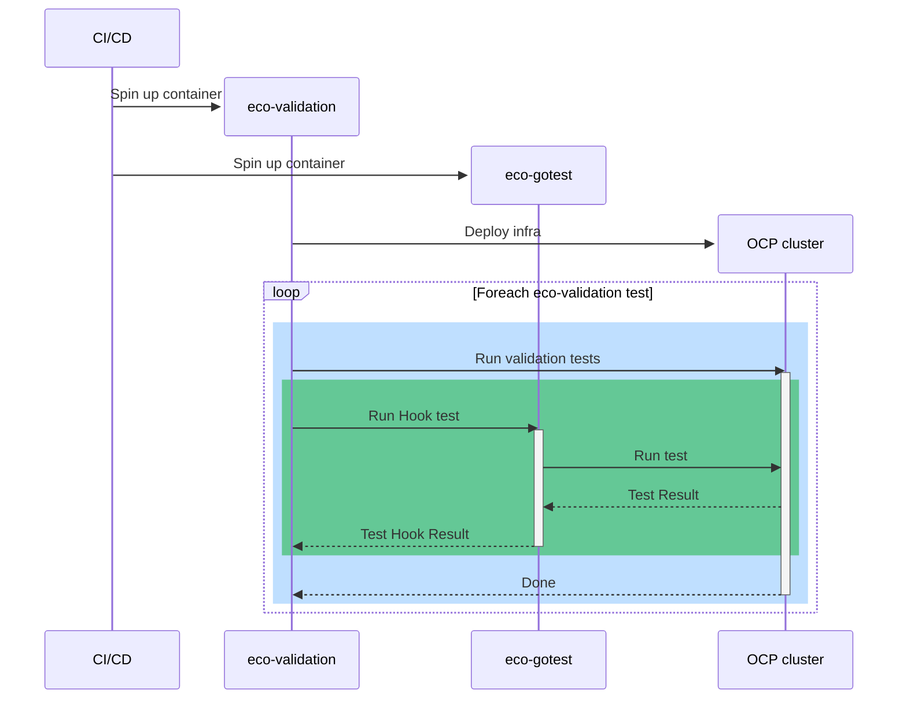

# Deploy and Test By Hooks
This is a PoC to showcase the procedure

## Sequence diagram



## Steps

In one terminal:
```
$ cd go-test/
$ make run
```

In other terminal:

```
$ make install
$ source .venv/bin/activate
(.venv) ansible-playbook playbooks/main.yml
```

## Outcome

Running Test hooks side:

```
$ make run
. . .
go run .
[GIN-debug] [WARNING] Creating an Engine instance with the Logger and Recovery middleware already attached.

[GIN-debug] [WARNING] Running in "debug" mode. Switch to "release" mode in production.
 - using env:   export GIN_MODE=release
 - using code:  gin.SetMode(gin.ReleaseMode)

[GIN-debug] POST   /run/tests                --> github.com/ccardenosa/deploy-and-test-by-hooks/go-test/backend.postRunTestsHandler (3 handlers)
[GIN-debug] GET    /tests/results            --> github.com/ccardenosa/deploy-and-test-by-hooks/go-test/backend.listTestResultsLangHandler (3 handlers)
[GIN-debug] [WARNING] You trusted all proxies, this is NOT safe. We recommend you to set a value.
Please check https://pkg.go.dev/github.com/gin-gonic/gin#readme-don-t-trust-all-proxies for details.
[GIN-debug] Listening and serving HTTP on 0.0.0.0:28081
2024/03/08 19:14:37 Running test Test_A in context[map[ticks_to_reach:1000]] for TS[Test-Suite-0001]...
2024/03/08 19:14:37 Running script...  tests/suites/ts-0001/test-a.sh
2024/03/08 19:14:37 StdOut:  [82 117 110 110 105 110 103 32 84 101 115 116 32 65 46 46 46 10]
2024/03/08 19:14:37 Running test Test_B in context[map[tag_to_match:Locked...]] for TS[Test-Suite-0001]...
2024/03/08 19:14:37 Running script...  tests/suites/ts-0001/test-b.sh
2024/03/08 19:14:37 StdOut:  [82 117 110 110 105 110 103 32 84 101 115 116 32 66 10]
[GIN] 2024/03/08 - 19:14:37 | 200 |   18.459619ms |             ::1 | POST     "/run/tests"
2024/03/08 19:14:38 Running test Test_A in context[map[ticks_to_reach:1000]] for TS[Test-Suite-0001]...
2024/03/08 19:14:38 Running script...  tests/suites/ts-0001/test-a.sh
2024/03/08 19:14:38 StdOut:  [82 117 110 110 105 110 103 32 84 101 115 116 32 65 46 46 46 10]
2024/03/08 19:14:38 Running test Test_B in context[map[tag_to_match:Locked...]] for TS[Test-Suite-0001]...
2024/03/08 19:14:38 Running script...  tests/suites/ts-0001/test-b.sh
2024/03/08 19:14:38 StdOut:  [82 117 110 110 105 110 103 32 84 101 115 116 32 66 10]
2024/03/08 19:14:38 Running test Test-0002 in context[map[data_to_be_used:map[data_1:D1 data_2:D2 data_N:DN] kubeconfig:/remote/path/to/kubeconfig-cluster-2]]...
2024/03/08 19:14:38 Running script...  tests/test-0002.sh
2024/03/08 19:14:38 StdOut:  [99 99 97 114 100 101 110 111 32 117 115 101 114 32 105 115 32 82 117 110 110 105 110 103 32 84 101 115 116 32 48 48 50 46 46 46 10]
[GIN] 2024/03/08 - 19:14:38 | 200 |   31.017041ms |             ::1 | POST     "/run/tests"
[GIN] 2024/03/08 - 19:14:39 | 200 |      96.045µs |             ::1 | GET      "/tests/results"
```

Ansible side:

```
. . .
TASK [tester-role : Setup test context] **************************************************************************************************************************************************************************************************************************
changed: [localhost] => (item={'name': 'Test-Suite-0001', 'type': 'suite', 'path': 'tests/suites/ts-0001', 'context': {'kubeconfig': '/remote/path/to/kubeconfig-cluster-1'}, 'tests': [{'name': 'Test_A', 'type': 'test', 'path': 'test-a.sh', 'context': {'ticks_to_reach': 1000}}, {'name': 'Test_B', 'path': 'test-b.sh', 'type': 'test', 'context': {'tag_to_match': 'Locked...'}}]})
changed: [localhost] => (item={'name': 'Test-0002', 'type': 'test', 'path': 'tests/test-0002.sh', 'context': {'kubeconfig': '/remote/path/to/kubeconfig-cluster-2', 'data_to_be_used': {'data_1': 'D1', 'data_2': 'D2', 'data_N': 'DN'}}})

TASK [tester-role : POST to run a test suites] *******************************************************************************************************************************************************************************************************************
ok: [localhost] => (item={'name': 'Test-Suite-0001', 'type': 'suite', 'path': 'tests/suites/ts-0001', 'context': {'kubeconfig': '/remote/path/to/kubeconfig-cluster-1'}, 'tests': [{'name': 'Test_A', 'type': 'test', 'path': 'test-a.sh', 'context': {'ticks_to_reach': 1000}}, {'name': 'Test_B', 'path': 'test-b.sh', 'type': 'test', 'context': {'tag_to_match': 'Locked...'}}]})
ok: [localhost] => (item={'name': 'Test-0002', 'type': 'test', 'path': 'tests/test-0002.sh', 'context': {'kubeconfig': '/remote/path/to/kubeconfig-cluster-2', 'data_to_be_used': {'data_1': 'D1', 'data_2': 'D2', 'data_N': 'DN'}}})

TASK [tester-role : Get Results] *******************************************************************************************************************************************************************************************************************************
ok: [localhost]

TASK [tester-role : Show results] ********************************************************************************************************************************************************************************************************************************
ok: [localhost] => {
    "results.json": {
        "results": {
            "Test-0002": {
                "Result": {
                    "b64Stdout": "Y2NhcmRlbm8gdXNlciBpcyBSdW5uaW5nIFRlc3QgMDAyLi4uCg==",
                    "pass": true
                },
                "context": {
                    "data_to_be_used": {
                        "data_1": "D1",
                        "data_2": "D2",
                        "data_N": "DN"
                    },
                    "kubeconfig": "/remote/path/to/kubeconfig-cluster-2"
                },
                "name": "Test-0002",
                "path": "tests/test-0002.sh",
                "tests": null,
                "type": "test"
            },
            "Test-Suite-0001": {
                "Result": {
                    "b64Stdout": "",
                    "pass": false
                },
                "context": {
                    "kubeconfig": "/remote/path/to/kubeconfig-cluster-1"
                },
                "name": "Test-Suite-0001",
                "path": "tests/suites/ts-0001",
                "tests": [
                    {
                        "Result": {
                            "b64Stdout": "UnVubmluZyBUZXN0IEEuLi4K",
                            "pass": true
                        },
                        "context": {
                            "ticks_to_reach": 1000
                        },
                        "name": "Test_A",
                        "path": "test-a.sh",
                        "tests": null,
                        "type": "test"
                    },
                    {
                        "Result": {
                            "b64Stdout": "UnVubmluZyBUZXN0IEIK",
                            "pass": true
                        },
                        "context": {
                            "tag_to_match": "Locked..."
                        },
                        "name": "Test_B",
                        "path": "test-b.sh",
                        "tests": null,
                        "type": "test"
                    }
                ],
                "type": "suite"
            }
        }
    }
}
. . .
```